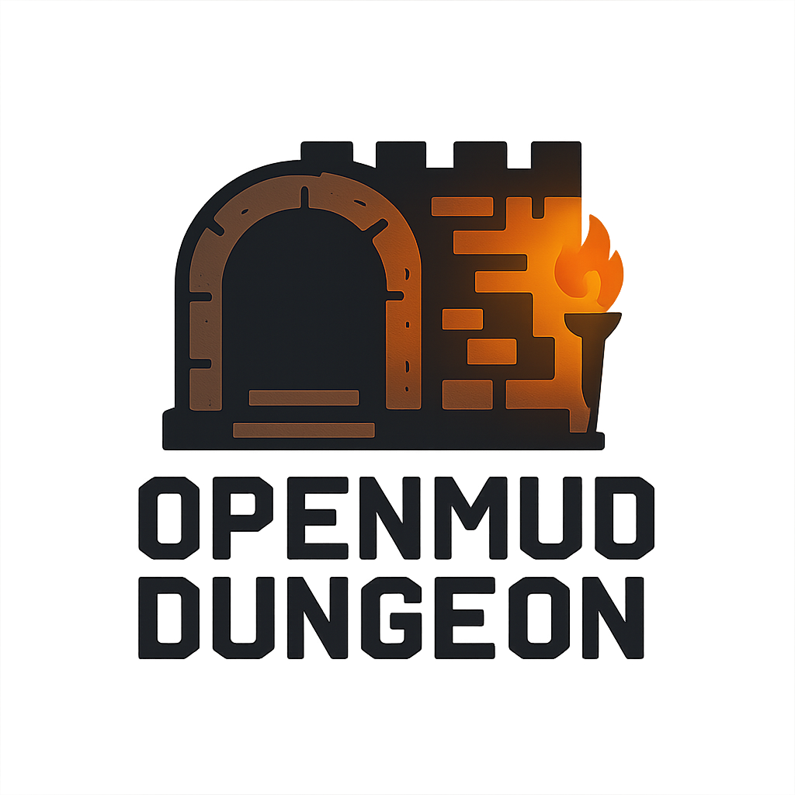

# 🎮 OpenMud MUD

<div align="center">
  
</div>

[](https://opensource.org/licenses/MIT)
[](https://www.python.org/downloads/)
[](https://github.com/psf/black)

Um jogo multiplayer tipo MUD (Multi-User Dungeon) que roda no terminal Linux, otimizado para uso com **TinTin++**.

## 🌐 Servidor Online

Você pode jogar agora mesmo no nosso servidor público:

**Endereço:** `tramway.proxy.rlwy.net`  
**Porta:** `57219`

### Como Conectar

#### Usando TinTin++ (Recomendado)
```bash
tt++
#session openmud tramway.proxy.rlwy.net 57219
```

#### Usando Telnet
```bash
telnet tramway.proxy.rlwy.net 57219
```

#### Usando Netcat (nc)
```bash
nc tramway.proxy.rlwy.net 57219
```

#### Usando Putty (Windows)
1. Abra o Putty
2. Em "Connection type", selecione **Raw**
3. Em "Host Name", digite: `tramway.proxy.rlwy.net`
4. Em "Port", digite: `57219`
5. Clique em **Open**

### Exemplo de Conexão Completa

**TinTin++:**
```
$ tt++
#session openmud tramway.proxy.rlwy.net 57219
#TRYING TO CONNECT 'openmud' TO 'tramway.proxy.rlwy.net' PORT '57219'.
#CONNECTED TO 'openmud'
Bem-vindo ao OpenMud MUD!
>
```

**Telnet:**
```bash
$ telnet tramway.proxy.rlwy.net 57219
Trying 66.33.22.156...
Connected to tramway.proxy.rlwy.net.
Escape character is '^]'.
Bem-vindo ao OpenMud MUD!
>
```

## 📋 Índice

- [Características](#-características)
- [Requisitos](#-requisitos)
- [Instalação](#-instalação)
- [Uso Rápido](#-uso-rápido)
- [Comandos](#-comandos)
- [Estrutura do Projeto](#-estrutura-do-projeto)
- [Documentação](#-documentação)
- [Configuração Avançada](#-configuração-avançada)
- [Desenvolvimento](#-desenvolvimento)
- [Contribuindo](#-contribuindo)
- [Licença](#-licença)

## ✨ Características

- 🎯 **Multiplayer em tempo real** - Jogue com outros jogadores
- 🗺️ **Sistema de salas e navegação** - Explore um mundo rico em detalhes
- 💬 **Chat entre jogadores** - Comunique-se com outros jogadores
- ⚔️ **Sistema de combate** - Batalhe contra monstros e outros jogadores
- 🎲 **Sistema de classes e raças** - Escolha sua classe e raça
- 📜 **Sistema de quests** - Complete missões e ganhe recompensas
- 🏰 **Dungeons** - Explore masmorras perigosas
- 🛒 **Sistema de lojas** - Compre e venda itens
- 🤖 **Geração de quests com IA** - Quests dinâmicas geradas por IA (opcional)
- 🌈 **Cores ANSI** - Interface colorida e visualmente agradável
- 🔌 **Compatível com TinTin++** - Otimizado para clientes MUD

## 📦 Requisitos

- **Python 3.7 ou superior**
- **Linux** (ou qualquer sistema com terminal)
- **TinTin++** (recomendado) ou telnet/netcat

## 🚀 Instalação

### 1. Clone o Repositório

```bash
git clone https://github.com/Luan1Schons/openmud.git
cd openmud
```

### 2. Instale as Dependências

```bash
pip install -r requirements.txt
```

Para instalar dependências opcionais de IA:

```bash
pip install -r requirements.txt
pip install openai  # ou anthropic
```

### 3. Instale o TinTin++ (Recomendado)

**Ubuntu/Debian:**
```bash
sudo apt update
sudo apt install tintin++
```

**Fedora:**
```bash
sudo dnf install tintin++
```

**Arch Linux:**
```bash
sudo pacman -S tintin++
```

**macOS:**
```bash
brew install tintin++
```

### Alternativa: Telnet/Netcat

Se preferir não usar TinTin++:

```bash
# Ubuntu/Debian
sudo apt-get install telnet
# ou
sudo apt-get install netcat
```

## 🎮 Uso Rápido

### Iniciar o Servidor

```bash
python3 server.py
```

O servidor iniciará na porta **4000** por padrão. Você verá mensagens indicando que o servidor está aguardando conexões.

### Conectar ao Jogo

#### Conexão Local

**TinTin++ (Recomendado):**
```bash
tt++
#session mud_local localhost 4000
```

**Telnet:**
```bash
telnet localhost 4000
```

**Netcat:**
```bash
nc localhost 4000
```

**Script automático:**
```bash
./connect.sh
```

#### Conexão Externa (Servidor Remoto)

Para conectar a um **servidor remoto** (servidor de produção, Railway, VPS, etc.):

**TinTin++:**
```bash
tt++
#session openmud <servidor> <porta>
```

**Telnet:**
```bash
telnet <servidor> <porta>
```

**Netcat:**
```bash
nc <servidor> <porta>
```

**Putty (Windows):**
1. Abra o Putty
2. Connection type: **Raw**
3. Host Name: `<servidor>`
4. Port: `<porta>`
5. Clique em **Open**

> **Nota:** O servidor já está configurado para aceitar conexões externas. Certifique-se de que:
> - A porta está aberta no firewall
> - O serviço de cloud está configurado corretamente para TCP
> 
> Para mais informações sobre deploy em serviços de cloud, veja [DEPLOY_RAILWAY.md](./DEPLOY_RAILWAY.md)

Para mais detalhes sobre conexão, consulte a [documentação completa](./docs/CONECTAR.md).

## ⌨️ Comandos

### Navegação
- `look` ou `l` - Olha ao redor na sala atual
- `norte`, `n` - Move para o norte
- `sul`, `s` - Move para o sul
- `leste`, `e` - Move para o leste
- `oeste`, `o` - Move para o oeste
- `cima`, `u` - Move para cima
- `baixo`, `d` - Move para baixo

### Comunicação
- `say <mensagem>` - Fala algo na sala atual
- `tell <jogador> <mensagem>` - Envia mensagem privada
- `who` ou `players` - Lista todos os jogadores online

### Inventário e Itens
- `inventory` ou `inv` - Lista itens no inventário
- `get <item>` - Pega um item da sala
- `drop <item>` - Deixa um item na sala
- `use <item>` - Usa um item

### Combate
- `attack <alvo>` ou `kill <alvo>` - Ataca um alvo
- `flee` - Tenta fugir do combate
- `stats` - Mostra suas estatísticas

### NPCs e Quests
- `talk <npc>` - Fala com um NPC
- `quest <npc>` - Ver quests de um NPC
- `accept <quest_id>` - Aceita uma quest
- `complete <quest_id>` - Completa uma quest

### Lojas
- `shop <npc>` - Abre a loja de um NPC
- `buy <item>` - Compra um item
- `sell <item>` - Vende um item

### Outros
- `help` ou `?` - Mostra ajuda completa
- `quit` ou `exit` - Sai do jogo

## 📁 Estrutura do Projeto

```
terminal_game/
├── server.py              # Servidor principal (entry point)
├── mud/                   # Pacote principal do jogo
│   ├── __init__.py
│   ├── core/              # Módulos principais
│   │   ├── __init__.py
│   │   ├── models.py      # Modelos de dados (Player, Monster, Item, etc.)
│   │   └── database.py    # Gerenciamento de banco SQLite
│   ├── managers/          # Gerenciadores do jogo
│   │   ├── __init__.py
│   │   ├── world_manager.py       # Gerenciador de mundos
│   │   ├── quest_manager.py       # Gerenciador de quests
│   │   ├── dungeon_manager.py     # Gerenciador de dungeons
│   │   ├── lore_manager.py        # Gerenciador de lore
│   │   ├── world_lore_manager.py  # Gerenciador de lore do mundo
│   │   └── game_data.py           # Dados do jogo (monstros, itens, NPCs)
│   ├── systems/           # Sistemas do jogo
│   │   ├── __init__.py
│   │   ├── combat.py              # Sistema de combate
│   │   ├── spells.py              # Sistema de magia
│   │   ├── classes.py             # Sistema de classes e raças
│   │   ├── character_creation.py  # Criação de personagens
│   │   └── monster_races.py       # Raças de monstros
│   ├── commands/          # Sistema de comandos
│   │   ├── __init__.py
│   │   └── commands.py    # Handler de comandos
│   ├── ai/                # Sistemas de IA
│   │   ├── __init__.py
│   │   └── ai_quest_generator.py  # Gerador de quests com IA
│   ├── auth/              # Sistema de autenticação
│   │   ├── __init__.py
│   │   └── auth.py        # Autenticação de jogadores
│   └── utils/             # Utilitários
│       ├── __init__.py
│       ├── ansi.py                # Códigos de cores ANSI
│       ├── visuals.py             # Visualizações e formatação
│       └── compatibility_test.py  # Testes de compatibilidade
├── worlds/                # Mundos do jogo
│   └── default/
│       ├── dungeons.json  # Dungeons
│       ├── items.json     # Itens
│       ├── monsters.json  # Monstros
│       ├── npcs.json      # NPCs
│       ├── quests.json    # Quests
│       ├── rooms_config.json  # Salas
│       └── world_lore.json    # Lore do mundo
├── docs/                  # Documentação
│   ├── README.md
│   ├── CONECTAR.md
│   ├── CREAR_NPC.md
│   ├── EXPANSAO_MUNDO.md
│   ├── QUESTS_EXPLICACAO.md
│   └── RESPAWN_SISTEMA.md
├── requirements.txt       # Dependências
├── pyproject.toml         # Configuração do projeto
├── .env.example           # Exemplo de variáveis de ambiente
├── LICENSE                # Licença MIT
├── CONTRIBUTING.md        # Guia de contribuição
├── CODE_OF_CONDUCT.md     # Código de conduta
└── CHANGELOG.md           # Histórico de mudanças
```

## 📚 Documentação

Documentação completa está disponível na pasta [`docs/`](./docs/):

- **[Como Conectar](./docs/CONECTAR.md)** - Guia completo de conexão
- **[Criar NPCs](./docs/CREAR_NPC.md)** - Tutorial para criar novos NPCs
- **[Expansão do Mundo](./docs/EXPANSAO_MUNDO.md)** - Documentação sobre expansão
- **[Sistema de Quests](./docs/QUESTS_EXPLICACAO.md)** - Como funcionam as quests com IA
- **[Sistema de Respawn](./docs/RESPAWN_SISTEMA.md)** - Documentação do sistema de respawn

## ⚙️ Configuração Avançada

### Configuração com IA (Opcional)

Para habilitar a geração dinâmica de quests com IA:

1. **Configure o arquivo .env:**
```bash
cp .env.example .env
```

2. **Edite o arquivo .env e adicione sua API key:**
```env
OPENAI_API_KEY=sk-your-openai-api-key-here
AI_PROVIDER=openai
```

3. **Obtenha uma API key:**
   - [OpenAI](https://platform.openai.com/api-keys)
   - [Anthropic](https://console.anthropic.com/) (alternativa)

O sistema tentará gerar quests dinamicamente quando NPCs não tiverem quests pré-definidas. Se não houver API key configurada, o sistema usará templates de fallback.

### Personalização de Mundos

Crie arquivos JSON na pasta `worlds/` para adicionar novos mundos. Veja a [documentação de expansão](./docs/EXPANSAO_MUNDO.md) para mais detalhes.

### Banco de Dados

O servidor usa SQLite para persistir:
- Dados de jogadores
- Progresso de quests
- Respawn de monstros
- Histórico de jogo

O banco é criado automaticamente na primeira execução como `mud.db`.

## 🛠️ Desenvolvimento

### Tecnologias Usadas

- **Python 3.7+** - Linguagem principal
- **asyncio** - Para gerenciamento de conexões assíncronas
- **SQLite** - Banco de dados embutido
- **JSON** - Armazenamento de dados do jogo

### Executando o Servidor

```bash
python3 server.py
```

O servidor usa `asyncio` para gerenciar múltiplas conexões simultaneamente. Cada jogador tem sua própria corrotina que processa comandos independentemente.

### Padrões de Código

- Siga **PEP 8** para estilo de código
- Use **type hints** quando possível
- Documente funções e classes com **docstrings**
- Mantenha linhas com no máximo 100 caracteres

Veja [CONTRIBUTING.md](./CONTRIBUTING.md) para mais detalhes.

## 🤝 Contribuindo

Contribuições são bem-vindas! Por favor:

1. Fork o projeto
2. Crie uma branch para sua feature (`git checkout -b feature/MinhaFeature`)
3. Commit suas mudanças (`git commit -m 'Adiciona MinhaFeature'`)
4. Push para a branch (`git push origin feature/MinhaFeature`)
5. Abra um Pull Request

Consulte o [guia de contribuição](./CONTRIBUTING.md) para mais detalhes.

## 📝 Notas

- O servidor aceita conexões de qualquer IP (0.0.0.0)
- Porta padrão: **4000**
- Timeout de inatividade: **5 minutos**
- Nomes de jogadores duplicados recebem um sufixo com o número da porta
- O servidor usa códigos ANSI para cores, compatíveis com TinTin++ e terminais modernos

## 📄 Licença

Este projeto está licenciado sob a Licença MIT - veja o arquivo [LICENSE](./LICENSE) para detalhes.

## 🙏 Agradecimentos

- Comunidade MUD por inspiração
- Desenvolvedores do TinTin++ pelo excelente cliente MUD
- Todos os contribuidores que ajudaram a melhorar este projeto

---

**Desenvolvido com ❤️ para a comunidade open source**
